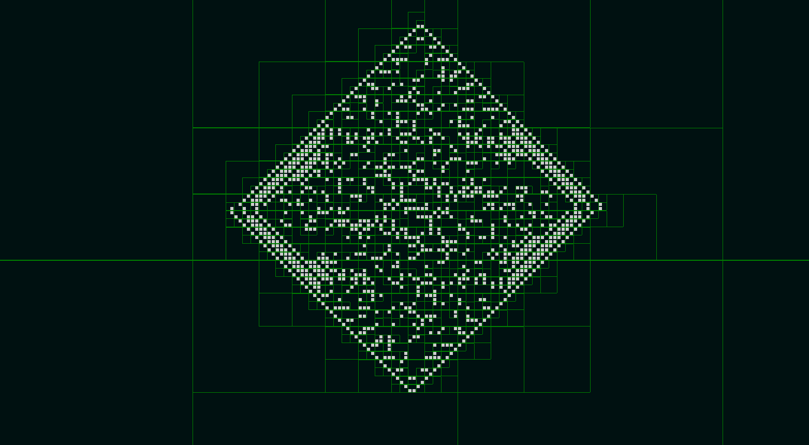

<!-- ABOUT THE PROJECT -->
## About The Project


An implementation of the famous Conway´s Game of life web version avaliable at 
[Game of life](https://as-thegameoflife.herokuapp.com/)

### Built With

All proyect was build with native HTML canvas for the principal simulation with the use 
of a datastructure called QuadTree and D3.js for charts and graphs

* [D3.js](https://d3js.org)


### Prerequisites

This is an example of how to list things you need to use the software and how to install them.
* npm
  ```sh
  npm install npm@latest -g
  ```

### Installation

1. Clone the repo
   ```sh
   git clone https://github.com/your_username_/Project-Name.git
   ```
2. Install NPM packages
   ```sh
   npm install
   ```
3. Run localy 
   ```sh
   node index.js
   ```

<!-- USAGE EXAMPLES -->

## Controls
- space for start the simulation 
- rigth click to draw/erase a cell 
- left click to move around the space 
- zoom 
## Other functions
- Change the rule of life 
- Changes colors 
- Upload and downdload patterns with extension .LIF
- Visualitation of atractors of small spaces 
- Charts of poblation, density and entropy 

